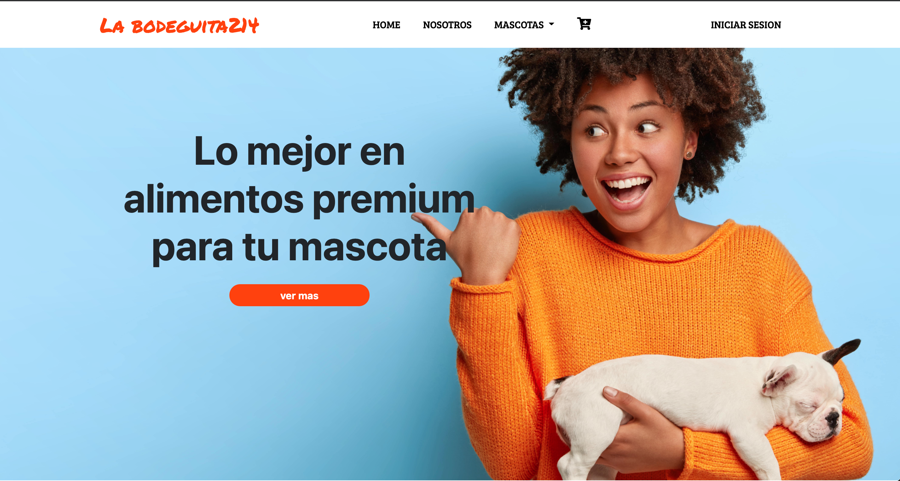
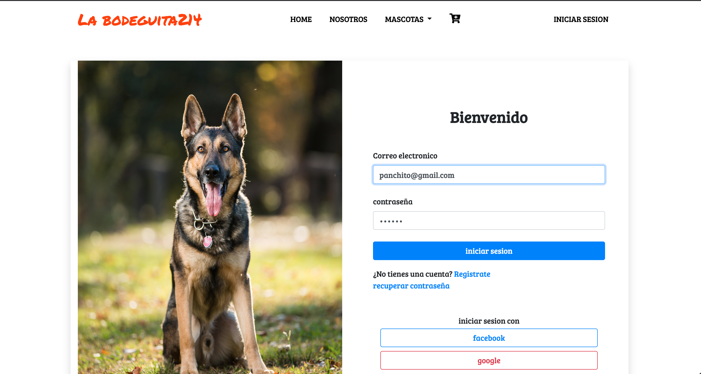
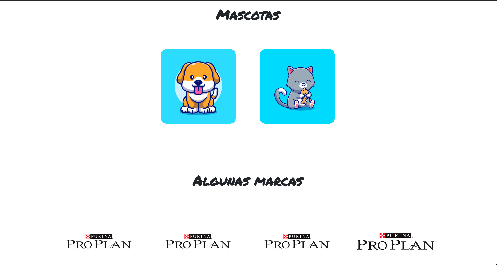
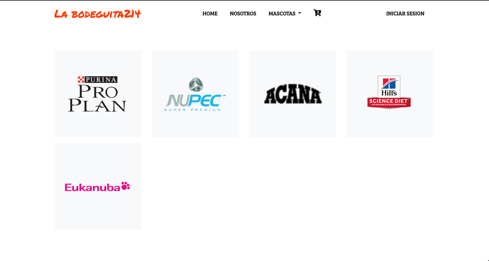

# Ecommerce 📦
_En este proyecto se desarrolla una web para la venta de alimentos para mascota esta acompañado de un servidor , el cual nos permite registrar nuevos clientes y mantener una sesion activa para realizar acciones dentro de la web_

This project was generated with [Angular CLI](https://github.com/angular/angular-cli) version 11.1.4.

## Development server

Run `ng serve` for a dev server. Navigate to `http://localhost:4200/`. The app will automatically reload if you change any of the source files.

To get more help on the Angular CLI use `ng help` or go check out the [Angular CLI Overview and Command Reference](https://angular.io/cli) page.

## comenzando 🚀
_Arrancar la aplicacion_
```
iniciar servidor( backend ) : nodemon index.js
```
```
iniciar app angular : ng serve -o
```






_Para mas detalles de funcionamiento revise el backend -_  
[backend](https://github.com/catzin/server-ecommerce/tree/318ddb9e902875481f69ee59290d8c4ac4d3d62e)

## Autor
* **Ehecatzin Vallejo** 
